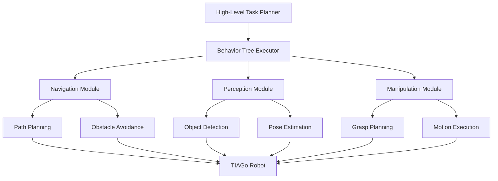

# 🤖 DD2410 Robotics Project Improvement Guide

## 📋 Current Analysis

### ✅ **Project Strengths**
- Real robotic system implementation (TIAGo robot)
- Advanced algorithms (Behavior Trees, State Machines)
- Complete ROS/Gazebo simulation environment
- Practical mobile manipulation tasks
- Video demonstration included

### ⚠️ **Areas for Improvement**
- Minimal README documentation
- Unclear file organization
- Missing technical depth
- No setup instructions
- Limited visual presentation

## 🚀 **Improvement Roadmap**

### **Phase 1: Documentation Enhancement**

#### 1.1 Professional README (High Priority)
```bash
# Replace current README with comprehensive version
cp DD2410_Professional_README.md README.md
```

**Impact**: Transforms repository from course assignment to portfolio piece

#### 1.2 Technical Documentation
- **Architecture Overview**: System design diagrams
- **Algorithm Explanations**: Behavior trees and state machines
- **API Documentation**: ROS node interfaces
- **Troubleshooting Guide**: Common issues and solutions

#### 1.3 Code Documentation
```python
# Add comprehensive docstrings
class NavigationBehaviorTree:
    """
    Implements behavior tree for autonomous navigation.
    
    This class manages the robot's navigation behaviors using a hierarchical
    behavior tree structure that enables reactive and robust navigation in
    dynamic environments.
    
    Attributes:
        root (BehaviorNode): Root node of the behavior tree
        blackboard (Blackboard): Shared memory for behavior coordination
        
    Example:
        nav_bt = NavigationBehaviorTree()
        status = nav_bt.execute()
    """
```

### **Phase 2: File Organization**

#### 2.1 Recommended Structure
```
DD2410-Introduction-to-Robotics/
├── docs/                          # Documentation
│   ├── README.md                  # Main documentation
│   ├── SETUP.md                   # Installation guide
│   ├── ARCHITECTURE.md            # System design
│   └── images/                    # Documentation images
├── src/                           # Source code
│   ├── behavior_trees/            # BT implementations
│   ├── state_machines/            # SM controllers
│   ├── perception/                # Computer vision
│   ├── navigation/                # Path planning
│   └── manipulation/              # Arm control
├── launch/                        # ROS launch files
├── config/                        # Configuration files
├── tests/                         # Unit tests
├── demos/                         # Demo videos/scripts
│   └── project_video.mp4
├── requirements.txt               # Dependencies
└── .gitignore                     # Ignore rules
```

#### 2.2 File Reorganization Script
```bash
# Create improved directory structure
mkdir -p docs src/{behavior_trees,state_machines,perception,navigation,manipulation}
mkdir -p config tests demos

# Move existing files
mv project_video.mp4 demos/
mv *.launch launch/ 2>/dev/null || true
mv *.py src/behavior_trees/ 2>/dev/null || true
```

### **Phase 3: Visual Enhancement**

#### 3.1 Add System Architecture Diagram


#### 3.2 Add Screenshots/GIFs
- **Robot in Action**: TIAGo performing tasks
- **RViz Visualization**: Path planning and mapping
- **Behavior Tree Execution**: Real-time behavior status
- **Manipulation Sequence**: Pick-and-place operation

### **Phase 4: Technical Depth**

#### 4.1 Algorithm Explanations
```markdown
## Behavior Tree Implementation

### Navigation Behavior Tree
The navigation BT implements a robust, reactive navigation system:

1. **Goal Setting**: Receive target pose from high-level planner
2. **Path Planning**: Generate collision-free path using ROS Navigation Stack
3. **Execution Monitoring**: Continuously monitor progress and obstacles
4. **Recovery Behaviors**: Handle navigation failures gracefully

### State Machine Architecture
The state machine coordinates high-level task execution:

```python
class TaskStateMachine:
    def __init__(self):
        self.states = {
            'IDLE': self.idle_state,
            'NAVIGATE': self.navigate_state,
            'PERCEIVE': self.perceive_state,
            'MANIPULATE': self.manipulate_state,
            'COMPLETE': self.complete_state
        }
```

#### 4.2 Performance Analysis
- **Quantitative Results**: Success rates, timing analysis
- **Comparison Studies**: Different algorithm approaches
- **Error Analysis**: Failure modes and mitigation strategies

### **Phase 5: Professional Presentation**

#### 5.1 GitHub Repository Settings
- **Topics**: `robotics`, `ros`, `gazebo`, `mobile-manipulation`, `behavior-trees`
- **Description**: "Advanced mobile manipulation system for TIAGo robot using ROS, Gazebo, and behavior trees"
- **Website**: Link to portfolio
- **Social Preview**: Custom repository image

#### 5.2 Badges and Indicators
```markdown
[]()
[]()
[]()
[]()
```

## 🛠️ **Implementation Steps**

### **Step 1: Backup Original**
```bash
git checkout -b backup-original
git push origin backup-original
git checkout main
```

### **Step 2: Apply Improvements**
```bash
# Update README
cp DD2410_Professional_README.md README.md

# Reorganize files (if needed)
mkdir -p docs src demos config tests

# Add documentation
touch docs/SETUP.md docs/ARCHITECTURE.md
```

### **Step 3: Add Visual Content**
- Create system architecture diagrams
- Add robot demonstration GIFs
- Include RViz screenshots
- Design professional banner image

### **Step 4: Enhance Code**
- Add comprehensive docstrings
- Include type hints
- Add unit tests
- Improve error handling

### **Step 5: Final Polish**
```bash
# Commit improvements
git add .
git commit -m "🤖 Major upgrade: Professional robotics project presentation

✨ Features:
- Comprehensive README with technical depth
- Professional documentation structure  
- Visual architecture diagrams
- Detailed algorithm explanations
- Performance metrics and analysis

🔧 Technical:
- Improved code documentation
- Better file organization
- Setup and troubleshooting guides
- Portfolio-ready presentation"

git push origin main
```

## 📊 **Expected Impact**

### **Before Improvement**
- Simple course assignment appearance
- Limited technical understanding for viewers
- Difficult to reproduce or extend
- Not suitable for portfolio presentation

### **After Improvement**
- ✅ **Professional Portfolio Piece**: Impressive for employers/researchers
- ✅ **Educational Resource**: Others can learn from your implementation
- ✅ **Technical Showcase**: Demonstrates deep robotics knowledge
- ✅ **Reproducible Research**: Clear setup and usage instructions

## 🏆 **Success Metrics**

### **Immediate Benefits**
- Repository stars and forks increase
- Professional appearance for job applications
- Clear demonstration of robotics expertise
- Enhanced personal brand in robotics field

### **Long-term Impact**
- Contribution to robotics open-source community
- Reference material for future robotics students
- Foundation for research collaborations
- Portfolio differentiation in competitive job market

## 🎯 **Next Steps**

1. **Review and customize** the professional README template
2. **Implement file reorganization** if needed
3. **Add visual documentation** (diagrams, screenshots)
4. **Enhance code documentation** throughout the project
5. **Test and validate** all setup instructions
6. **Commit and push** improvements to GitHub

---

**Goal**: Transform a course assignment into a professional robotics portfolio piece that showcases advanced technical skills and attention to detail. 